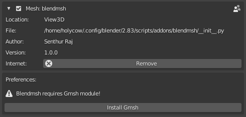
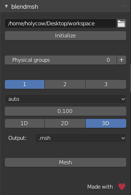
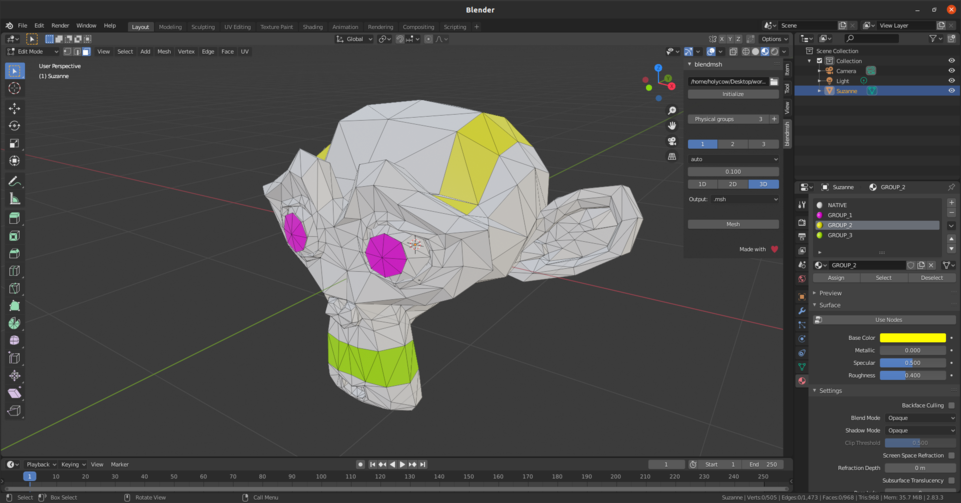
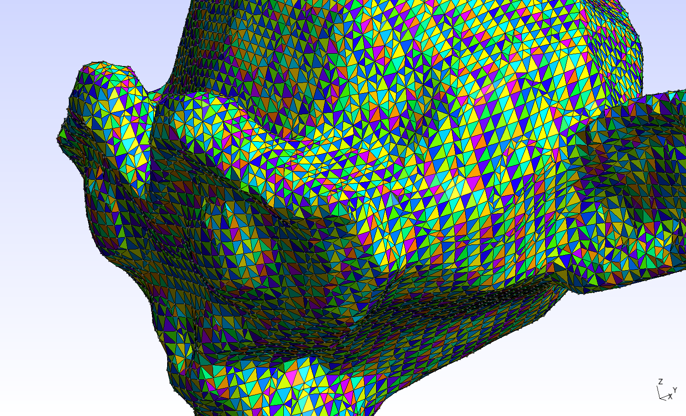

# Blendmsh

Blendmsh is a bridge between Blender 2.80+ and Gmsh, a fast and light 3D finite element mesh generator.

## Installation

*   Download the latest release as a '.zip' file and head over to Blender 2.80+.
*   Go to **Edit->Preferences->Add-on->Install** and point to the downloaded '.zip' file.
*   Make sure that the installed add-on is enabled.
*   Once enabled, the add-on looks for Gmsh module, it prompts for an installation if Gmsh module is not found. Kindly install it either via the prompt or manually.

## Usage
### Parameters

*   Workspace path
*   Physical groups
*   Element order
*   Meshing algorithm
    *   auto
    *   meshadapt
    *   del2d
    *   front2d
    *   delquad
    *   pack
    *   initial2d
    *   del3d
    *   front3d
    *   mmg3d
    *   hxt
    *   initial3d

*   Element size
*   Mesh dimension
*   Output
    *   .msh
    *   .inp
    *   .vtk

### Definition of Physical Groups
Physical groups can be defined by assigning materials to faces (Boundaries).

### Output
Output mesh is saved to the specified workspace path, it can then be imported into FreeCAD, OpenFOAM, Paraview or anyother application that supports the above mentioned mesh format.

## Issues
Report any issues or feedback [here](https://github.com/blender-for-science/blendmsh/issues).

## References
*   [Gmsh](http://gmsh.info/doc/texinfo/gmsh.html)
*   [gmsh-api](https://pypi.org/project/gmsh-api)
